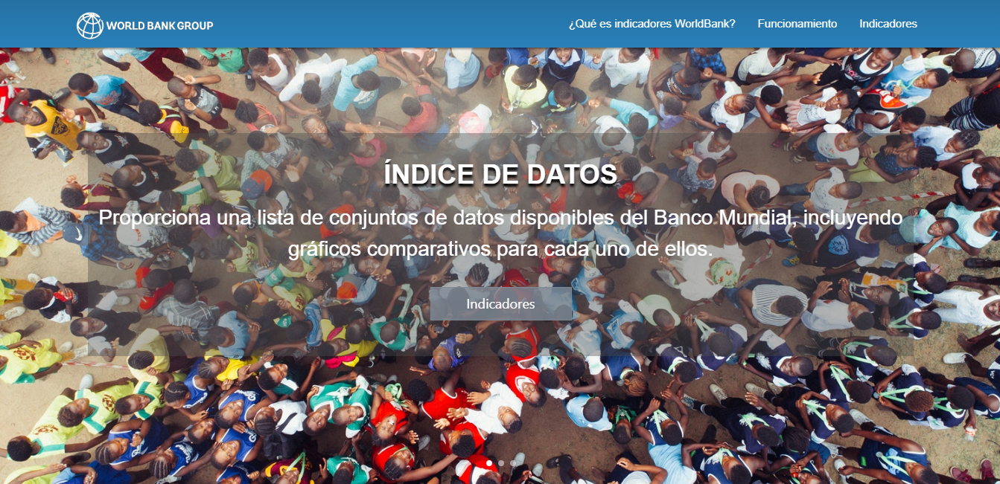

# Indicadores World Bank

## ¿Qué es Indicadores World Bank? 

Es una aplicación web que proporciona una lista de los datos disponibles de [Indicadores World Bank](https://faog.github.io/SCL008-data-lovers-worldbank/src/index.html). Esta agrupa información de países latinoamericanos  y  le permite al usuario realizar busquedas a partir de distintos indicadores demograficos, económicos y comerciales.  

Para trabajar bajo los estándares de la industria, se propone el desarrollo de un producto que se encuentre centrado en el público objetivo y que busque la adaptabilidad a sus necesidades y requerimientos. 

## Planificación 🚀

La planificación del trabajo corresponde a una iteración del proyecto data lovers, comenzazndo un nuevo proyecto a partir de la data disponible del [Banco Mundial](http://www.bancomundial.org/). Para que esa gran cantidad de información contenida sea atractiva y utilizable por los usuarios, se propone filtrarla de acuerdo a 138 indicadores, mostrando como resultado un gráfico de lineas comparativo entre los países Brasil, Chile, México y Perú; resultando de manera amigable para quienes visiten esta aplicación web.

### Definición: ¿Quién es nuestro usuario? 

Debido a que en está iteración el objetivo era profundizar sobre lo aprendido de Front-end, no se realizó encuestas o prototipados; solo se solicito información a otros grupos que realizaron este proyecto con anterioridad y en base a eso, se crea esta iteración.

### Consideraciones en el desarrollo 🛠️

**Ejecución del interfaz de usuario HTML, CSS, JS**

* HTML para mostrar la página al usuario y unir los script de JavaScript y links de CSS, Materialize (incluyendo link al cdn de jquery para usar sus funciones) y Google Chart. 
* Uso de HTML dinámico desde el main.js 
* Manejo del DOM desde main.js 
* Desarrollo de funciones de filtrar y ordenar desde data.js 
* Uso de la data del Banco Mundial partir de worldbank.js
* Testeo de funciones desde data.spec.js 
* Manejo de estilos CSS para la página de escritorio y responsivo, usando media query para celulares y Tablet.
* Trabajo colaborativo mediante el uso de Git y GitHub 
* Deploy con gh-pages de la aplicación [Indicadores World Bank](https://faog.github.io/SCL008-data-lovers-worldbank/src/index.html) 

**Implementación de las funciones solicitadas**

* *filterData(data, condition)*, para lograr filtrar la data por los 138 indicadores disponibles. Estos son desplegados a partir de un gráfico de línea, implementado desde la libreria gráfica de [Google Chart](https://developers.google.com/chart/interactive/docs/).

* *sortData(data, sortBy, sortOrder)*, para ordenar los nombres de los indicadores de forma alfabética. 

**Aspectos técnicos**

* Para el desarrollo de estilos de PokeChoose se complementó el trabajo con el uso del framework [Materialize](https://materializecss.com/)

* Se realizó test para comprobar el funcionamiento de la aplicación, logrando los siguientes resultados: 
    - % Statements: 100 ; % Branch: 100 ; % Functions: 100 ; % Lines: 100
        
### Futuras mejoras ⌨️

* Implementar la función computeStats.
* Consumir la data de forma dinámica a partir de un archivo json.

### Autora 📌

* Fabiola Orellana 

8° Generación de Laboratoria.

Marzo, 2019.